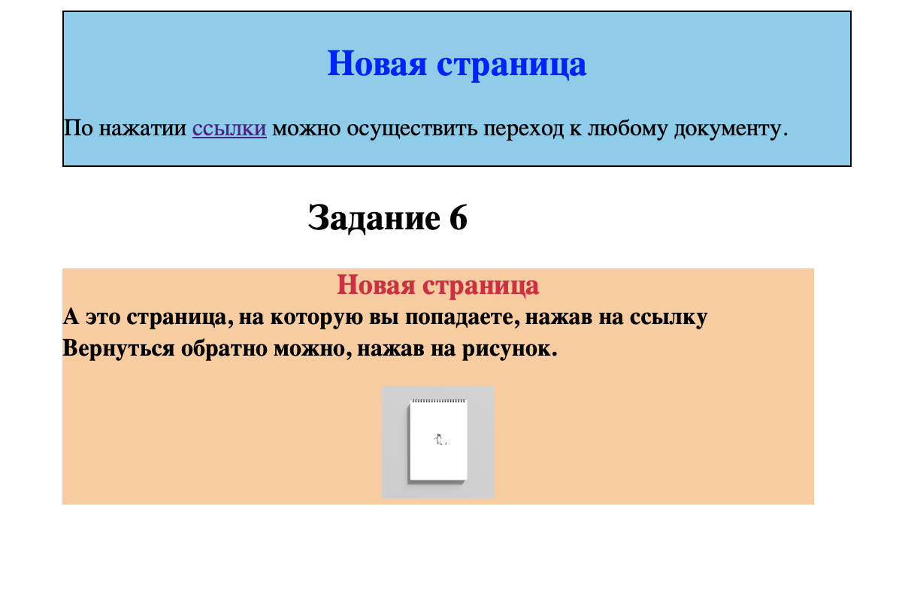
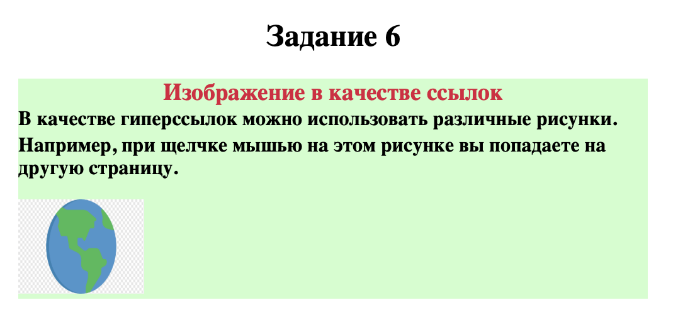

# Проверка домаашнего задания
Работа, проверенная мной пронадлежит **Пачину Кириллу**

 **Ссылка** на работу:  https://kiruxa123zxc.github.io/Text-rep/hyperlinks/obhfile.html
___
 При проверке мной не найдены какие-либо технические ошибки, есть лишь несколько правок:

1. При выполнении 2 и 3 задания ссылки ведут на пустой сайт. 
Технически задание никак не на нарушено, но хотелось бы видеть там хоть что-то, а не пустой экран.

2. При выполнении 5 и 6 задания ссылки ведут на одну страницу. 
Это так же не является ошшибкой, но отмечу это

3. При выполнении 6 задания была использована картинка без фона.
Так же не является ошибкой, но для улучшения общего впечатления от работы, желательно убирать фон, использовав фото таких форматов, как PNG и SVG

---
Повторюсь, что при выполнении работы не было допущено оошибок, и все перечисленное выше - лишь некоторые правки, не влияющие на функционаьность сайта