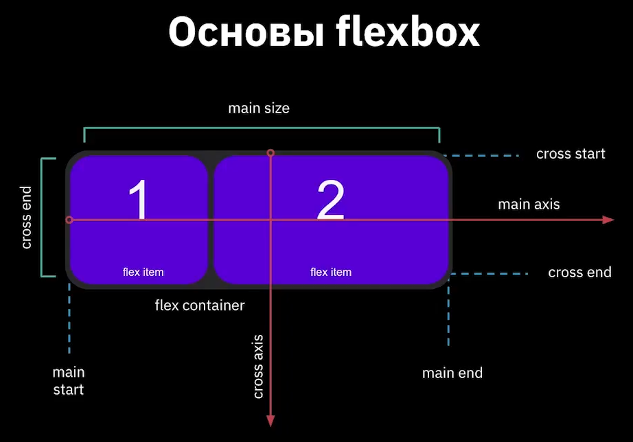
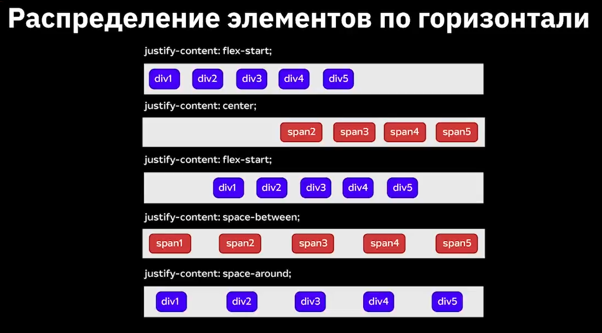
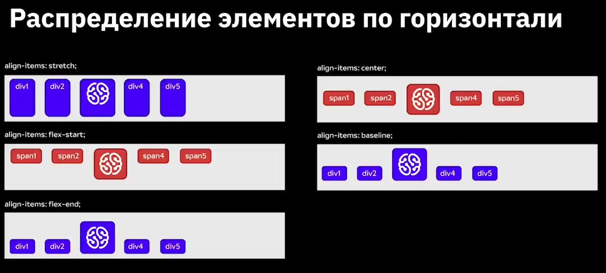

# Что такое HTML и CSS

**Интернет** - информационная компьютерная сеть

Каждый компьютер имеет свой уникальный **IP-адрес**

**Доменное имя**-это название и одновременно адрес сайта в интернете. Имеет составные части, разделенные точками

1. Доменное имя 1 уровня: google.ru
2. Доменное имя 2 уровня: google.disk.ru
3. Доменное имя 3 уровня: gogle.disk.1.ru

# Устройство сайта

Сайт состоит из:

    Шапка (Header)
    Меню (menu)
    Основное наполнение(content)
    Футр (footer)

# Виды сайтов

1. Резиновые (дизайн, в котором ширина задана в процентах от текущего разрешения экрана)
2. Фиксированные ширины (дизайн, в котором ширина задана ив пикселях, то есть оговорены точно)
3. Адаптивные (дизайн подстраивается под размер экрана)

Сайты делятся на

    Статические (контиент подготовлен, и выдается пользователю в том виде, в котором хранится)

    Динамические (содержимое генерируется при помощи серверных языков программирования)

# Основные протоколы

    HTTP  
    HTTPS  
    FTP

**Схема HTTP запроса:**

Клиент<----->Сервер<----->База данных

Клиент отправляет запрос серверу (http запрос), сервер обращается к базе данных (sql запрс). База данных возвращается данные серверу, сервер отправляет html страницу клиенту

# Процесс разработки сайта

**Идея**-->**дизайнер**-->**frontend-разработчик**-->**backend-разработчик**-->**сайт**

Но это не все, для готового сайта нужен 

    1. маркетинг
    2. копирайдер
    3. тестировщик

# ТЕГи

    1. Парные теги:
        
Прараграф
Жирный текст</b
        <i>Курсив</i>
___
    2. Одиночные теги:
         перенос строки
        
горизонтальная черта
___
# Атрибуты тегов
<название_тега
атрибут1="значение атрибута">
текст внутри тега
</название_тега>

# Структура HTML-документа

## Оформление текстов на веб-страницах
        <B>Жирный текст
        <I>Курсивный текст</I>
        <U>Подчеркнутый текст </U>
        <S>Зачеркнутый текст </S>
        E=mc2 -Верхний индекс 
        H2 -Нижний индекс 
        <big>увеличенный текст</big>

## Спецсимволы
Для отображения символов, кторых нет в клавиатуре, применяются специальные знаки:

    &nbsp - неразрывный пробел\
    &copy - знак copyright
    &quot и &raquo - двойные ковычки
    &rsquo и &prime - одиночный штрих

 Альтернативный метод - типограф

**Типограф**-средство онлайн-подготовки текста к веб-изданию. Помогает избежать ручной замены большого количества текста, символов, которых нет клавиатуре, и т.д. 

# Коментарии
<!--Описание основной части сайта-->

Текст основной части сайта

# Списки
**Маркированные списки**

    <ul>
        <li>first element</li>
        <li>second element</li>
    </ul>

**Нумерованный список**

    <ol>
        <li>first element</li>
        <li>second element</li>
    </ol>

# Ссылки

**Типы ссылок**
1. Относительные
2. Абсолютные
3. Якорь по ссылке

# Изображения
Изображения могут быть нескольких форматов. Самым подходящим для нас является SVG.

Изображения в html добавляются при помощи следующей строки:
    
     

___
___
___
# CSS
**CSS**-язык описания внешнего вида документа, написанного с использованием языка-разметки. Используется для описания внешнего вида веб-страницы

## Синтаксис CSS
    Селектор{
        свойство1:значение1;
        свойство1:значение1;
    }
**Пример**

    p{
        color:green;
    }

## Способы объявления CSS
1. Inline-стили
2. CSS в разделе head
3. Подключение внешнего файла

## Комментарии
Комменртнарии создаются следующим образом:

    /*Комментарий*/

## Inline стили
**Плюсы**-можно прописывать стиль для определения элемента
**Минусы**-Необходимо прописывать стили для каждого тега

## Style in head
**Плюсы**-можно прписывать стили для нескольких элементов
**Минусы**-необходимо добавлять стили для каждой стрницы

## Единицы измерения CSS
1. **Относительные** (пиксели, проценты)
2. **Абсолютные** (сантиметры, милиметры)
___
**Единицы измерения цвета**

1. Именованные
2. Функциональные
3. Шестнадцатеричные

**width, height**- ширина и высота
___
**background**-фон элемента

    * background-color: #ff0
    * background-image: url(img/photo.jpg)
    * background-position: top;(bottom|left|right)
    * background-repead: repead-x; (repead-y|no-repead)
    * background-size: cover; (contain|100%)
Объединенное значение: 

    background: #ff0 url(img/photo.jpg) top repead-x; 

# border
**border-рамка**
1. border-color:red;(#f00|rgb(255,0,0));
2. border-style: solid; (botted|dashed|groove|ridge|solid|double|inset|outset);
3. border-width: 2px;

**border-width(толщина рамки)**
1. (1px 2px)-1px:верхняя и нижняя, 2px:левая и правая
2. (1px 2px 3px)-1px:верхняя, 2px:левая и правая, 3px:нижняя
3. (1px 2px 3px 4px)-1px:верхняя, 2px:правая, 3px:нижняя, 4px:левая
___
**color**-цвет текста
* color: red;
* color: #78fa2e
* color: rgb(34,21,56)

**font**-шрифт текста
* font-family:"Times New Roman", serif, Verdana;
* serif-шрифты с засечками
* sans-serif-рубленные шрифты, без засечек

1. font-style: italic;
2. font-variant: small-caps;
3. font-weight: bold;
4. font-size: 20px;
___
# list-style - вид маркера
1. list-style-type: circle
2. list-style-position: inside
3. list-style-image: url

# Редактирование текста 
1. text-align: center
2. text-decoration: none
3. text-transform: capitalize
___
# Наследование и группирование свойств
**html**

    
В этом параграфе весь текст <b>будет</b> красного цвета и шрифтом<b><i>размером 18 px</i></b>

**css**

    p {
        font-size: 18px;
        color: red;
    }
# Блочный способ размещения контента по странице

# Основы позиционирования

## Свойство Display

**Значения:**
## **none**
скрывает элементы, пока мы на них не наведем курсор
## **block**
ширина и высота блоков
## **inline**
комбинация элементов;
## **inline-block**
* элемент находится в строке, но при этом ему должны быть выставлены параметры ширины и высоты. 
* Можно задать параметры ширины и высоты
* являются частью строки
* размер устанавливается по содержимому
* элемент всегда прямоугольный
## **flex**
гибкость; наделение контейнера способностью изменять ширину или высоту для поддержки всех видов дисплеев и разных разрешений 
* элементы могут сжиматься и растягиваться
* выравнивание не только по вертикали, но и по горизонтали 
* элементы могут автоматически выстраиваться в несколько строк
* возможность формирования блоков справа налево

**Синтаксис CSS**
1. Главная ось(main axis) и перпендикулярная ось(cross axis)
2. Начало (main-start) и конец (main-end) направления главной оси
3. main- size и cross-size - ширина или высота flex-элемента
4. cross-start и cross-end - начало и конец вертикальной оси

## **grid layout**
сетка;
___

___

Ссылка на тренажер по этой теме: https://flexboxfroggy.com/#ru

___
## Flex box и Grid layout
### Основы Grid
**Особенности:**
1. Распределение элементов не только горизонтально, но и вертикально
2. Обьединение ячеек по горизонтали и вертикали
3. Гибкая адаптивная сетка для создания проектов любой сложности
4. Хорошая поддержка браузерами

**Основные понятия**
1. Линии сетки (**grid lines**) - невидимые горизонтальные и вертикальные разделительные линии
2. Дорожка сетки (**grid track**) - пространство между двумя соседними линиями в сетке
3. Ячейки сетки (**grid cell**) - пространство, ограниченное четырьмя линиями сетки
4. Элементы сетки (**grid items**) - отдельные элементы, которые назначаются областями сетки

**Колонки** grid-template-columns - создание сетки из колонок

**Столбцы** grid-template-rows - создание сетки из строк

**Отступы** gap - промежутки между элементами

**Единицы измерения** - **px** ; **%** ; **fr** ; **auto** .

Тренажер на тему позиционирования: https://cssgridgarden.com/#ru

## Позиционирование блоков (position)

Позиционирование позволяет точно определить, где появчятся блоки относительно окна браузера или других элементов на веб-странице

Position
* **static** - нормальное (по умолчанию)
* **relative** - относительное 
* **absolute** - абсолютное
* **fixed** - фиксированное
* **inherit** - наследует значение родителя

Свойства перемещения
* left
* right
* top
* bottom

# Основы создания адаптивного сайта

## Новые параметры ширины и высоты

Параметры ширины и высоты:
* max-width - максимальная ширина
* min-weigh - минимальная ширина
* max-height - максимальная высота
* min-height - минимальная высота
* % - процентное значение

## Единицы измерения ширины и высоты устройства

* vh - высота отображения устройства
* vw - ширина отображения устройства

## Медиа-запросы

**Медиа запросы** - фильтры, которые можно применять к стилям CSS, позволяющие изменять стили на основании характеристик устройства

1. Разрешение экрана
2. Ширина
3. Высота
4. Ориентация экрана

**Условия для Media Queries**
1. @media(max-width: XXXpx){}
2. @media(min-width: XXXpx){}
3. @media(min-width: XXXpx)
    and(max-width: YYYpx){}
4. @media(max-device-width: XXXpx){}
___
# HTML 5
## Новые семантические элементы
**Новый способ структурирования страниц**

    <header> - шапка сайта или раздела, в котором может располагаться один или несколько заголовков, группа информационных цепочек, информация об авторе

    <nav> - навигация по странице, меню

    <main> - Основное, уникальное для каждой страницы содержиме сайта

    <footer> - подвал сайта или раздела, где может содержаться информация об авторе

    <section> - применяется для новостей, блоков информации. Чаще содержит заголовок

    <article> - раздел контента, образующий независимую часть документа или сайта, например статья в журнале, комментарий

    <aside> - контент страницы, который можно убрать со страницы без потери смысла для сайта

    <figure> - тег-контейнер для иллюстрации или диаграммы обычно с подписью

    
 - виджет, который пользователь может открыть или закрыть

    
 - в этот тег заключается текст, который необходимо скрыть

**Семантическиеэлементы для работы с сайтом**

    <time> - определяет дату, время, например для выделения даты создания сатьи или контента, регистрации на сайте

    <wbr> - мето разрыва длинной строки

## Модерация стандартной  HTML-формы
* Добавление подсказок
* Фокусировка на элементе
* Проверка ошибок
* Добавление даты
* Создание поля имейла и числа

## Добавление аудио и видео 

**Аудио**

    <audio> - используется для внедрения звукового контента веб-страницы

    controls - добавляет отображение браузерами интерфейса упраления аудиоплеера - кнопки воспроизведения, поузы, громкости

    autoplay - фвтоматически запускает на странице аудиофайл

    loop - при завершении композиции она запустится снова

    muted - отключает звук 

    preload - какую часть аудио требуется загрузить браузеру для ускорения запуска аудио

    src- указывает путь к файлу

**Видео**

    <video> - добавление видео на веб-страницы, а так же стиль внешнего вида видеоплеера при помощи CSS

    Тег <video> применяет такие же атрибуты src, controls, autoplay, loop

    poster - выставляет изображение, которое браузер будет использовать, пока бразер загружается

**preload**
* auto - видео загружается полностью, чтобы он был доступен, когда пользователь начнет воспроизведение
* metadata - браузер загружает первую часть, чтобы определить его основные характеристики
